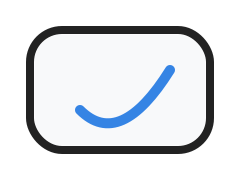
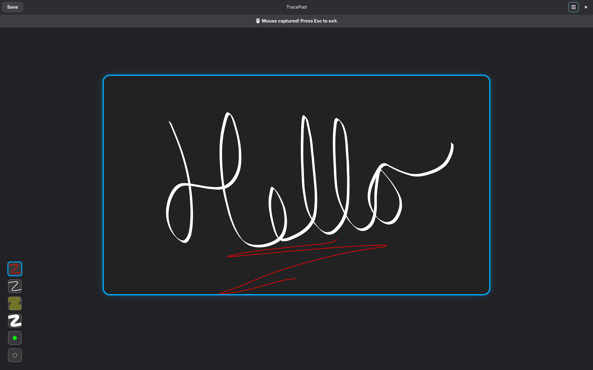

# TracePad

  

**Touch-based drawing on Linux using absolute touchpad input — built with GTK4 and libadwaita.**

TracePad is a minimal Linux app that turns your laptop's touchpad into a drawing surface using **absolute touchpad positioning**. It's ideal for capturing **handwritten signatures**, making quick **notes** or **doodles**, all within a sleek, modern Libadwaita interface.

## ✨ Why "TracePad"?

The name **TracePad** reflects its purpose:

- **Trace** — for drawing, handwriting, or signing  
- **Pad** — your laptop's touchpad or a digital notepad  

Together, they describe a tool that lets you use your laptop’s touchpad as an intuitive sketching surface.

## 🧠 Motivation

Back in high school, I was fascinated by the idea of using my laptop's touchpad for raw drawing input, but Windows drivers made accessing absolute positioning nearly impossible.

Years later, on Linux, I discovered that `evdev` allows access to raw touchpad data. So I decided to finally experiment with it by building a quick 3-day project—**TracePad**. I chose **GTK4 and libadwaita** because I've used GNOME for years but never built anything with GTK before. This app is both a technical exploration and a creative tool.

## ✍️ Features

- Fullscreen canvas with pointer hidden (Wayland workaround)
- Multiple pen types:
  - Ballpoint
  - Highlighter
  - Calligraphy pen
  - Pointer
- Eraser tool
- Undo / redo / clear canvas
- Save to **SVG** or **PNG**
- Keyboard shortcuts
- Preferences dialog to customize and manage pens

**Planned:**
- Browse/open saved sketches  
  - Import from SVG or define custom file format
- Save user preferences (via dconf or similar)
- Add `.desktop` file and integrate application icon
- Publish to nixpkgs
- (Low-priority) Palm rejection for capacitive stylus
- (Low-priority) Real-time stroke smoothing  
  - Path smoothing algorithms  
  - [jSignature: Line Smoothing](https://willowsystems.github.io/jSignature/%2523%252Fabout%252Flinesmoothing%252F.html)

## 🧑‍💻 Developer Notes

- Wayland restricts pointer locking/capturing, so fullscreen + hidden pointer is used instead.

-  (🐞) External link icon in `Adw.AboutDialog` doesn't render

- UI cleanup
  - Use Blueprint and fully adopt libadwaita styling  
    - Currently unable to load libadwaita 1.5 in Python (unclear why)
  - Refactor UI structure to separate presentation from behavior.
    Right now, `app.py` mixes both logic and display, which makes it hard to maintain.

## 📚 References
- [fingerpaint](https://github.com/Wazzaps/fingerpaint) — Similar project
- [vibeapps](https://github.com/knoopx/vibeapps) — Python apps managed via Nix
- [GTK4 Python Tutorial](https://github.com/Taiko2k/GTK4PythonTutorial) — Learn GTK4 in Python

## 💡 Future Experiments

- Handwriting recognition
- Symbol recognition for LaTeX and Typst  
  - Like [Detexify](http://detexify.kirelabs.org/)  
  - [QuarticCat/detypify](https://github.com/QuarticCat/detypify)
- Geometry sketching app (math symbols and diagrams)
